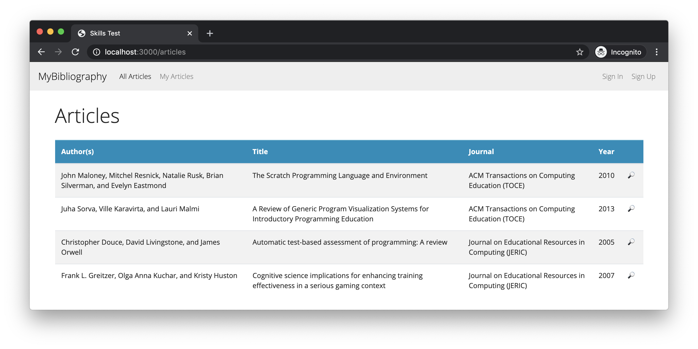
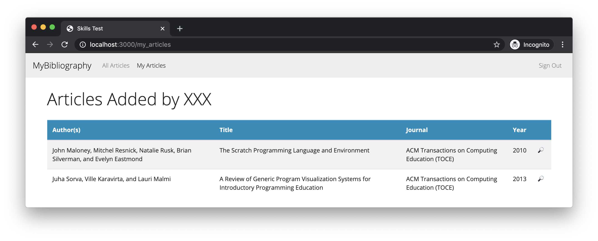
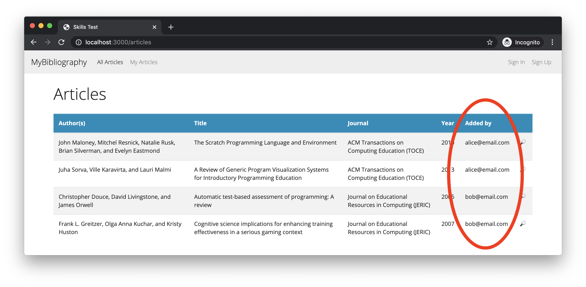
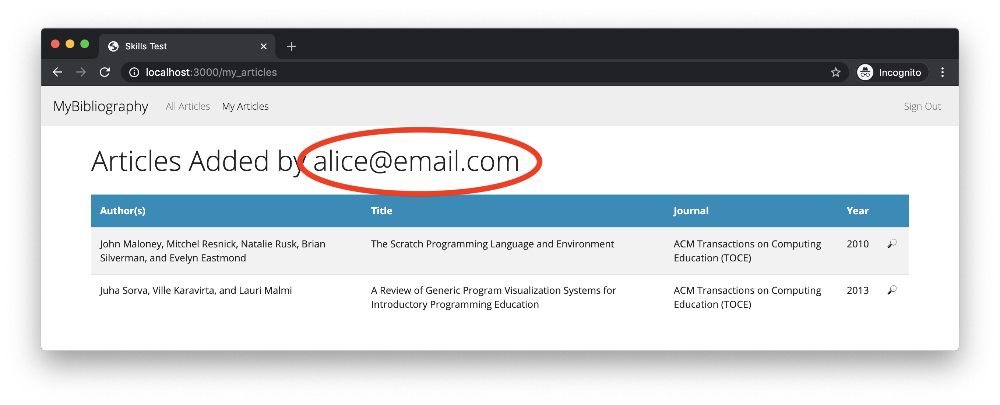

# Skills Test S7

## Part 1. Starting the Test

1. Start the screen-capture recording.

1. In your web browser, google the query string "`current time`", so the current time is displayed and captured in the recording.

1. In the terminal, change directory into the skills test project directory and verify that the working directory is clean:

    ```bash
    git status
    ```

    If there are any uncommitted changes or any untracked files in your working directory, then you will need to do something about them before proceeding.

1. In the terminal, download and checkout the branch for the test:

    ```bash
    git fetch
    git checkout --track origin/comp4081-s07
    ```

1. Initialize the project by doing the following:
   1. Install the Gems for the project using `bundle`.
   1. Install the JavaScript dependencies for the project using `yarn`.

1. Reset the database using this command:

    ```bash
    rails db:migrate:reset db:seed
    ```

Do nothing further at this point, and read on.

## Part 2. Development Tasks

For this test, you have been given a partially complete Rails app for managing bibliographic citations, and it is your job to complete the app.

Here is the current state of the app.

The app currently has two model classes, `User` and `Article`. The app has basic Devise login functionality, and the `User` class was generated with Devise in the usual way. The `Article` class is used to represent citation info for articles. An association has been added between the `User` class and `Article` class to represent which citations were added to the system by which user.

The app has seed data, that includes two users and some articles that each user has added to the system.

If you run the app and open the URL <http://localhost:3000> in the browser, you will see this `index` page for all the articles stored in the database.



Note that this page corresponds to the "`All Articles`" link in the navbar. The "`My Articles`" navbar link is supposed to take a signed-in user to an `index` page with only the articles that that user added to the system. Also, note that the "`🔎`" link next to each article are supposed to take the user to a `show` page with a citation for that particular article. These `🔎` links work the same on both the _All Articles_ and the _My Articles_ `index` pages.

If you sign in as the seeded user `alice@email.com`, the _My Articles_ `index` page currently looks like this:



### Task 1. Require Sign-In to Access Certain Pages

Updated the app's code so that users must be signed in in order to access the _My Articles_ `index` page and the `show` pages for articles. Note that users should not need to be signed in in order to access the _All Articles_ `index` page. If a non-signed-in user tries to access one of the secured pages, the app should redirect the user to the sign-in page (the standard behavior provided by Devise).

### Task 2. Add an Added-By Column to the All Articles `index` Page

On the _All Articles_ `index` page, add a column to the table that lists the email of the user who added the article to the system, as shown in this screenshot:



### Task 3. Add the Current User's Email to the My Articles Heading

On the _My Articles_ `index` page, add the current user's email address to the `h1` heading for the page, as shown in this screenshot:



### Task 4. Fix the Sign-Out Link

The sign-out link on the navbar is currently broken. It currently just hyperlinks the user to the root page of the app. Fix it so that the link actually signs the user out (and redirects the browser to the root page, as is the standard Devise behavior).

## Part 3. Test Submission

Once you've completed all of the above, submit your work by doing the following:

1. Commit all your changes to the local repo:

    ```bash
    git add -A
    git commit -m "Completed comp4081-s07"
    ```

1. Generate a ZIP archive of your project by running the following command from within the top-level folder of your project's working directory:

    ```bash
    git archive -o ../comp4081-s07-submission.zip --prefix=comp4081-s07-submission/ HEAD
    ```

    This command should result in a file `comp4081-s07-submission.zip` being created in your `workspace` folder.

1. Upload this ZIP file to the [eCourseware](https://elearn.memphis.edu/) dropbox labeled `comp4081-s07 zip (no video)`.

    **This step must be completed by the end of the test time.**

1. Stop your screen-capture recording such that a video file containing the recording is now created.

1. Upload your video recording to the [eCourseware](https://elearn.memphis.edu/) dropbox labeled `comp4081-s07 video only`. Click the "`Record Video`" link to upload your video.

    A 15-minute grace period is given beyond the end of the test time for the submission of your video.

1. Close your laptop, and sit quietly until the test period is over. You may **NOT** use your laptop or any device while you wait. However, you may, for example, read a book that you brought with you.
