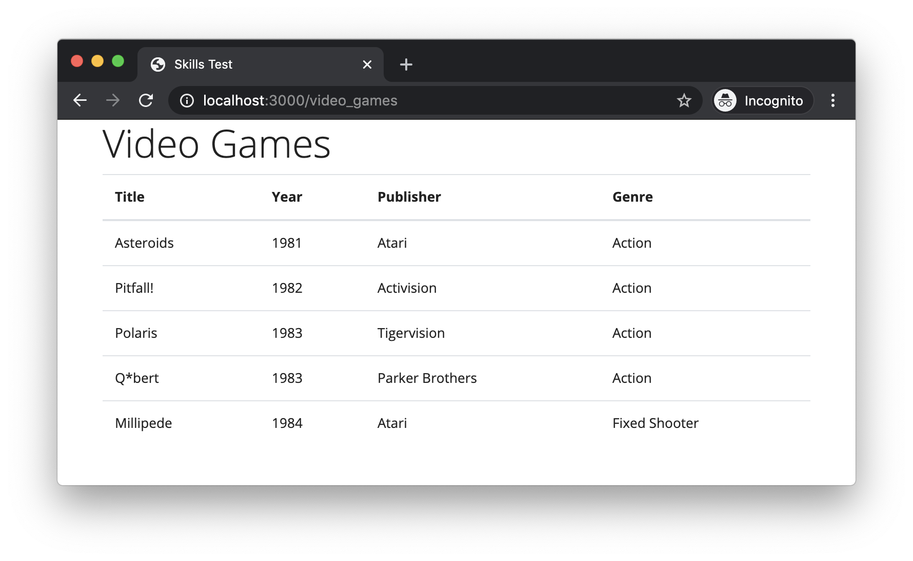
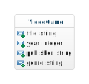

# Skills Test S3

## Part 1. Starting the Test

1. Start the screen-capture recording.

1. In your web browser, google the query string "`current time`", so the current time is displayed and captured in the recording.

1. In the terminal, change directory into the skills test project directory and verify that the working directory is clean:

    ```bash
    git status
    ```

    If there are any uncommitted changes or any untracked files in your working directory, then you will need to do something about them before proceeding.

1. In the terminal, download and checkout the branch for the test:

    ```bash
    git fetch
    git checkout --track origin/comp4081-s03
    ```

1. Initialize the project by doing the following:
   1. Install the Gems for the project using `bundle`.
   1. Install the JavaScript dependencies for the project using `yarn`.

1. Reset the database using this command:

    ```bash
    rails db:migrate:reset
    ```

Do nothing further at this point, and read on.

## Part 2. Development Tasks

For this test, you have been given a partially complete Rails app, and it is your job to complete the app.

The web app is currently broken (so there's no point in trying to run it at this point).

The app is supposed to display the following page when the URL <http://localhost:3000/video_games> is entered into the browser:



To complete this app, you must do the following:

1. Generate a `VideoGame` model class and migrations, as per this class diagram:

   

1. Migrate and seed the database. (The `db/seeds.rb` file has already been completed for you.)

1. You should now be able to run the app, although you will see that it is not yet complete.

1. Complete the existing `index` controller action.

1. Complete the existing HTML.ERB view.

Your solution must follow this constraint: The data displayed in the table must be retrieved by the controller and passed to the view for rendering.

## Part 3. Test Submission

Once you've completed all of the above, submit your work by doing the following:

1. Commit all your changes to the local repo:

    ```bash
    git add -A
    git commit -m "Completed comp4081-s03"
    ```

1. Generate a ZIP archive of your project by running the following command from within the top-level folder of your project's working directory:

    ```bash
    git archive -o ../comp4081-s03-submission.zip --prefix=comp4081-s03-submission/ HEAD
    ```

    This command should result in a file `comp4081-s03-submission.zip` being created in your `workspace` folder.

1. Upload this ZIP file to the [eCourseware](https://elearn.memphis.edu/) dropbox labeled `comp4081-s03 zip (no video)`.

    **This step must be completed by the end of the test time.**

1. Stop your screen-capture recording such that a video file containing the recording is now created.

1. Upload your video recording to the [eCourseware](https://elearn.memphis.edu/) dropbox labeled `comp4081-s03 video only`. Click the "`Record Video`" link to upload your video.

    A 15-minute grace period is given beyond the end of the test time for the submission of your video.

1. Close your laptop, and sit quietly until the test period is over. You may **NOT** use your laptop or any device while you wait. However, you may, for example, read a book that you brought with you.