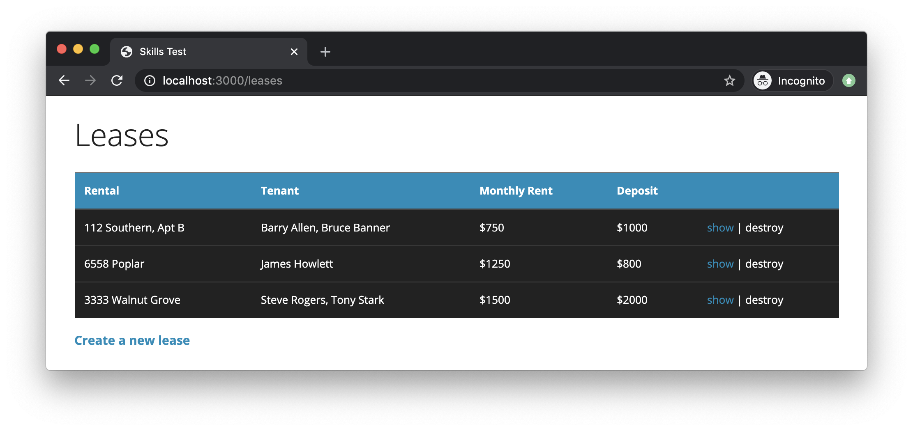
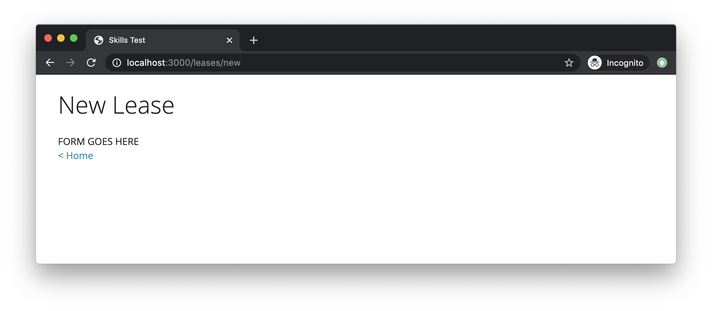
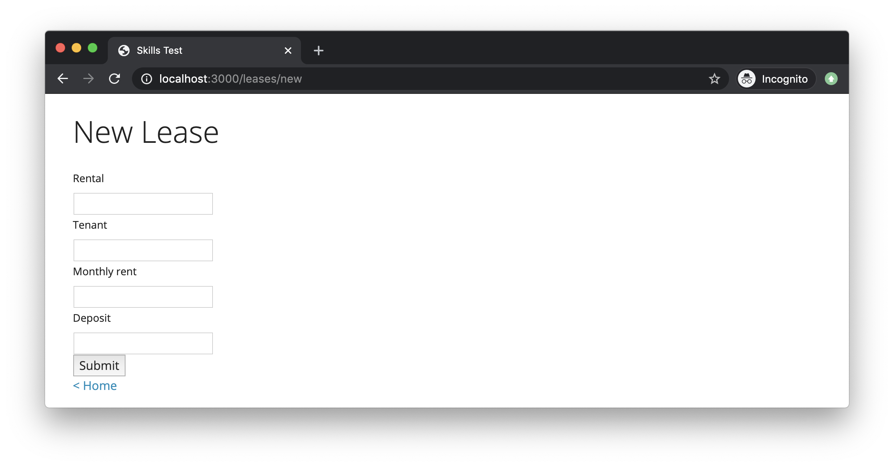

# Skills Test S5-Retry

## Part 1. Starting the Test

1. Start the screen-capture recording.

1. In your web browser, google the query string "`current time`", so the current time is displayed and captured in the recording.

1. In the terminal, change directory into the skills test project directory and verify that the working directory is clean:

    ```bash
    git status
    ```

    If there are any uncommitted changes or any untracked files in your working directory, then you will need to do something about them before proceeding.

1. In the terminal, download and checkout the branch for the test:

    ```bash
    git fetch
    git checkout --track origin/comp4081-s05retry
    ```

1. Initialize the project by doing the following:
   1. Install the Gems for the project using `bundle`.
   1. Install the JavaScript dependencies for the project using `yarn`.

1. Reset the database using this command:

    ```bash
    rails db:migrate:reset db:seed
    ```

Do nothing further at this point, and read on.

## Part 2. Development Tasks

For this test, you have been given a partially complete Rails app, and it is your job to complete the app.

The app manages lease agreements, and it displays the following `index` page when the URL <http://localhost:3000> is entered into the browser:



You can confirm that this page displays correctly by running the app now and opening the above URL in your browser.

There are two features that are only partially implemented in this app:

1. The feature for creating new leases.
1. The feature for deleting existing leases.

Regarding the first feature, currently, if you click the "`Create a new lease`" link on the `index` page, you will see a page that looks like this:



However, this page is supposed to contain a working form, like this:



Regarding the delete feature, the "`destroy`" text in each row of the `index` table is supposed to be a hyperlink that the user can click to delete the corresponding lease; however, currently, the text isn't even a hyperlink.

Your task is to complete these two features so that they work properly.

Hint: The controller and model parts of the app are already complete—you shouldn't need to modify their code at all.

## Part 3. Test Submission

Once you've completed all of the above, submit your work by doing the following:

1. Commit all your changes to the local repo:

    ```bash
    git add -A
    git commit -m "Completed comp4081-s05retry"
    ```

1. Generate a ZIP archive of your project by running the following command from within the top-level folder of your project's working directory:

    ```bash
    git archive -o ../comp4081-s05retry-submission.zip --prefix=comp4081-s05retry-submission/ HEAD
    ```

    This command should result in a file `comp4081-s05retry-submission.zip` being created in your `workspace` folder.

1. Upload this ZIP file to the [eCourseware](https://elearn.memphis.edu/) dropbox labeled `comp4081-s05retry zip (no video)`.

    **This step must be completed by the end of the test time.**

1. Stop your screen-capture recording such that a video file containing the recording is now created.

1. Upload your video recording to the [eCourseware](https://elearn.memphis.edu/) dropbox labeled `comp4081-s05retry video only`. Click the "`Record Video`" link to upload your video.

    A 15-minute grace period is given beyond the end of the test time for the submission of your video.

1. Close your laptop, and sit quietly until the test period is over. You may **NOT** use your laptop or any device while you wait. However, you may, for example, read a book that you brought with you.
